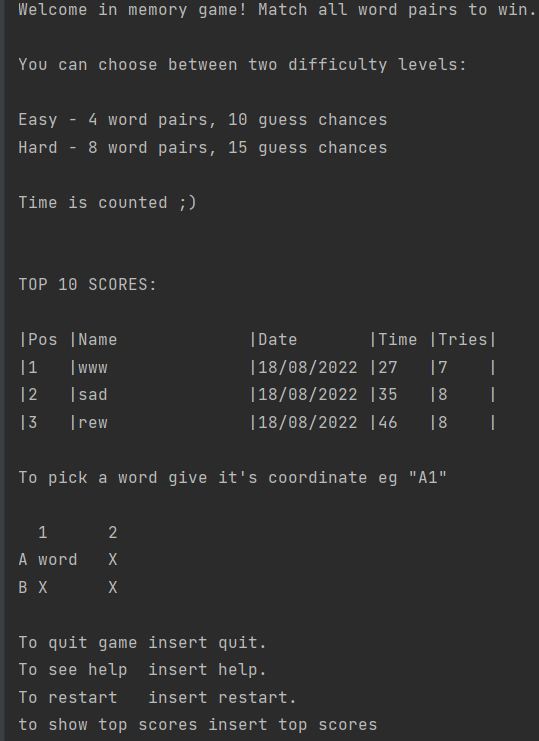
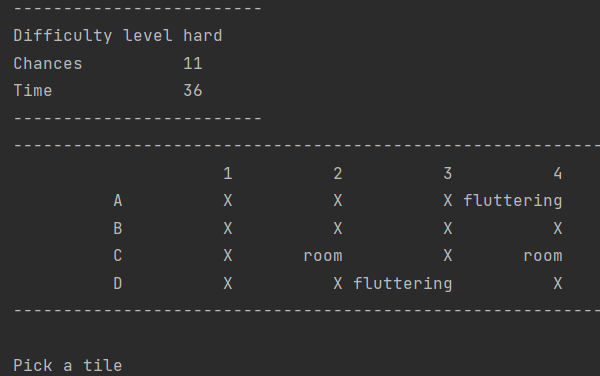

# About me 

Hi, I am Mateusz, I am a (final year) student and an engineer.

 My curiosity and perseverance are reasons why I code. As I am strongly willing to experience more from the surrounding
  world and understand it I did start coding. The joy of learning it and applying it to many issues as well as, my
   recent professional experience encouraged me to utilize what I've learned in my professional path.

# About the project

## Table of Contents
* [General Info](#general-information)
* [Technologies Used](#technologies-used)
* [Features](#features)
* [Screenshots](#screenshots)
* [Project Status](#project-status)
* [Room for Improvement](#room-for-improvement)
<!-- * [License](#license) -->

## General Information

This project aims to create a wonderful memory game that will allow me to participate in 
the Motorola academy program. It is my solution according to the requirements specified in the task.
It is also a great way of challenging myself and enjoying my passion for coding :)

## Technologies Used
For the sake of the purpose of the project, I describe my way of working in more detail than is necessary.
- IDE - IntelliJ IDEA 2022.2 (Community Edition)
- Issue tracking and project management - ClickUp
- JUnit5
- JDK - JDK 18

## Features
List the ready features here:
- A Welcome message with instructions and top scores 
- Two difficulty levels (changes number of guessing chances and pairs of words to match)
- Play again
- show game statistics while playing (chances left, time)
- save score
- record all scores, show the top 10
- estimates time, guesses, and difficulty as a single score

## Screenshots

## Project Status
The project is: _on Hold_. Working on improvement of UI.java code, unit tests, creating GUI.

## Room for Improvement
The Main field of improvement is reliability. Although it seems reliable after manual testing,
included automated tests are not sufficient. 

Room for improvement:
- testing (especially validation methods)
- GUI
- database (consider : SQLite, JSON)
- UI, validation methods 
