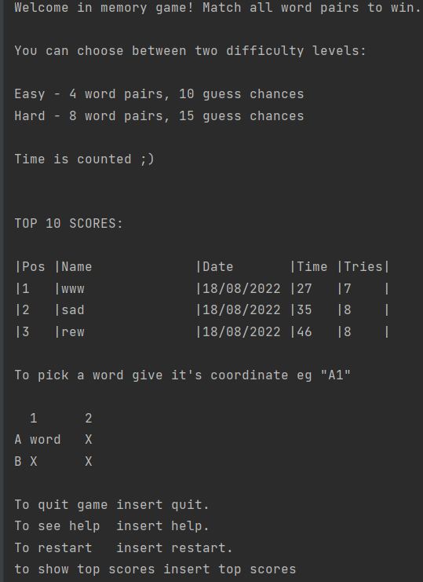
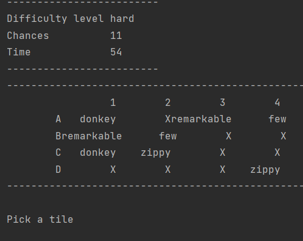

# About me 

Hi, I am Mateusz, I am a student and an engineer.

 My curiosity and perseverance are reasons why I code. As I am strongly willing to experience more from the surrounding
  world and understand it I did start coding. The joy of learning it and applying it to many issues as well as, my
   recent professional experience encouraged me to utilize what I've learned in my professional path.

# About the project

## Table of Contents
* [General Info](#general-information)
* [Technologies Used](#technologies-used)
* [Features](#features)
* [Screenshots](#screenshots)
* [Project Status](#project-status)
* [Room for Improvement](#room-for-improvement)
<!-- * [License](#license) -->

## General Information

The aim of this project is to create a wonderful memory game which will allow me to participate in 
Motorola academy program. It is my solution according to requirements specified in the task.
It is also great way of challenging myself and enjoy passion to coding :)

## Technologies Used
For the sake of the purpose of the project, I describe my way of working in more detail than it is necessary.
- IDE - IntelliJ IDEA 2022.2 (Community Edition)
- Issue tracking and project management - ClickUp
- JUnit5
- JDK - JDK 18

## Features
List the ready features here:
- Welcome message with instruction and top scores 
- Two difficulty levels (changes number of guessing chances and pairs of words to match)
- Play again
- show game statistics while playing (chances left, time)
<!-- - save high score -->
- save score
- record all scores, show top 10
- estimates time, guesses and difficulty as single score

## Screenshots

<!-- If you have screenshots you'd like to share, include them here. -->

## Project Status
Project is: _in progress_.

## Room for Improvement
Main field of improvement is in reliability. Although it seems reliable after manual testing,
included automated tests are not sufficient. 

Room for improvement:
- testing
- GUI
- database (consider : SQLite, json)
